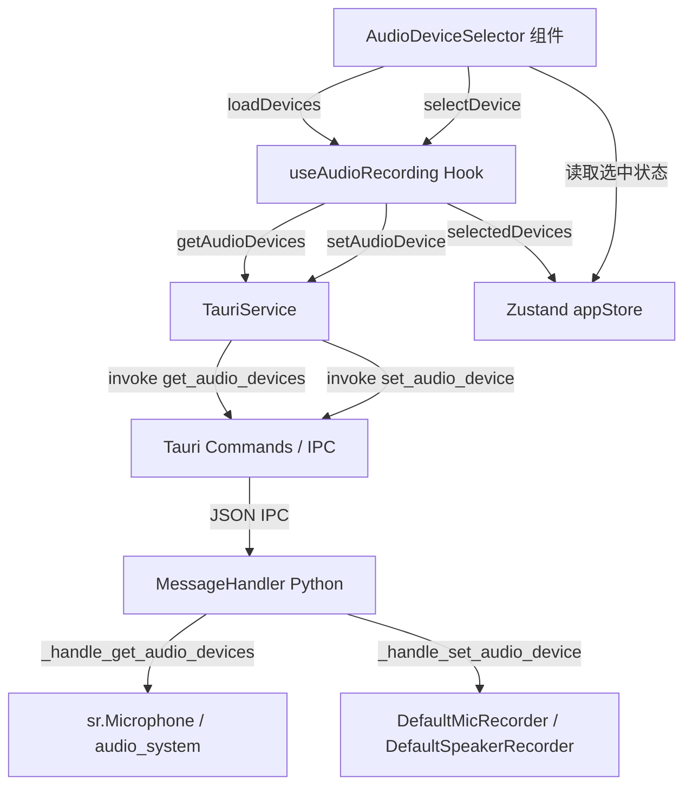

# 设计文档：音频设备选择

## 概述

本功能在 DeepEcho 应用中添加音频设备选择 UI，允许用户在控制面板中选择麦克风和扬声器（环回）设备。架构遵循现有的 Tauri + React + Python 三层结构：前端 React 组件通过 Tauri IPC 调用 Python 后端，后端枚举系统音频设备并管理录制器的重置与重启。

## 架构



## 组件与接口

### 前端：AudioDeviceSelector 组件

新建 `frontend/src/components/AudioDeviceSelector.tsx`，集成到 `ControlPanel` 或作为独立面板嵌入 `App.tsx`。

**Props 接口：**
```typescript
interface AudioDeviceSelectorProps {
  onDeviceChange?: (deviceType: 'microphone' | 'speaker', deviceId: string) => void;
}
```

**渲染结构：**
- 麦克风下拉菜单（Select）：列出所有 `deviceType === 'microphone'` 的设备
- 扬声器下拉菜单（Select）：列出所有 `deviceType === 'speaker'` 的设备
- 刷新按钮：重新加载设备列表
- 加载状态指示（CircularProgress）
- 错误提示（Alert）

### 前端：useAudioRecording Hook 扩展

在现有 `useAudioRecording.ts` 中扩展状态，增加选中设备的追踪：

```typescript
// 新增状态
const [selectedMicId, setSelectedMicId] = useState<string | null>(null);
const [selectedSpeakerId, setSelectedSpeakerId] = useState<string | null>(null);
```

`selectDevice` 方法增强逻辑：
1. 若当前正在录音，先调用 `stopRecording()`
2. 调用 `setAudioDevice(deviceType, deviceId)`
3. 更新 store 中的选中设备状态
4. 若之前在录音，调用 `startRecording(deviceType)` 重启

### 前端：Zustand Store 扩展

在 `frontend/src/store/appStore.ts` 中新增音频设备选择状态：

```typescript
interface AudioDeviceState {
  selectedMicId: string | null;
  selectedSpeakerId: string | null;
  setSelectedMicId: (id: string | null) => void;
  setSelectedSpeakerId: (id: string | null) => void;
}
```

### 后端：MessageHandler（已有，无需修改）

`_handle_get_audio_devices` 和 `_handle_set_audio_device` 已实现，但需要验证：
- `_handle_get_audio_devices` 返回的设备对象需包含 `deviceType` 字段（当前返回 `id`、`name`、`is_default`，缺少 `deviceType`）
- 需要在返回数据中补充 `deviceType: "microphone"` 和 `deviceType: "speaker"`

**修改 `_handle_get_audio_devices` 返回格式：**
```python
microphones.append({
    "id": str(idx),
    "name": name,
    "deviceType": "microphone",   # 新增
    "is_default": idx == 0
})

speakers.append({
    "id": str(speaker_info.get("index", 0)),
    "name": speaker_info.get("name", "Default Speaker"),
    "deviceType": "speaker",       # 新增
    "is_default": True,
    ...
})
```

## 数据模型

### AudioDevice（前端类型，已有）

```typescript
interface AudioDevice {
  id: string;
  name: string;
  deviceType: string; // "microphone" | "speaker"
}
```

### 后端设备响应格式

```python
{
  "microphones": [
    {"id": "0", "name": "Built-in Microphone", "deviceType": "microphone", "is_default": True},
    {"id": "1", "name": "USB Microphone", "deviceType": "microphone", "is_default": False}
  ],
  "speakers": [
    {"id": "5", "name": "Speakers (Realtek)", "deviceType": "speaker", "is_default": True,
     "sample_rate": 44100, "channels": 2}
  ]
}
```

### Zustand Store 新增字段

```typescript
selectedMicId: string | null      // 当前选中的麦克风设备 id
selectedSpeakerId: string | null  // 当前选中的扬声器设备 id
```

## 正确性属性

*属性（Property）是在系统所有有效执行中都应成立的特征或行为——本质上是关于系统应该做什么的形式化陈述。属性是人类可读规范与机器可验证正确性保证之间的桥梁。*

---

**属性 1：设备列表字段完整性**

*对任意* 调用 `_handle_get_audio_devices` 的结果，返回列表中的每个设备对象都应包含非空的 `id`、`name` 和 `deviceType` 字段，且 `deviceType` 的值只能是 `"microphone"` 或 `"speaker"`。

**Validates: Requirements 1.2**

---

**属性 2：异常安全性**

*对任意* 导致设备枚举失败的异常（如 pyaudio 未安装、权限拒绝等），`_handle_get_audio_devices` 都应返回包含 `error` 字段的响应对象，且 `microphones` 和 `speakers` 字段为空列表，而不是抛出未捕获异常。

**Validates: Requirements 1.4**

---

**属性 3：set_audio_device 通用成功响应**

*对任意* 有效的 `device_type`（`"microphone"` 或 `"speaker"`）和任意 `device_id` 字符串，`_handle_set_audio_device` 都应返回包含 `status: "success"` 的响应，且对应的录制器实例被重置为 `None`。

**Validates: Requirements 2.2, 3.2**

---

**属性 4：无效设备类型错误响应**

*对任意* 不属于 `"microphone"` 或 `"speaker"` 的 `device_type` 值，`_handle_set_audio_device` 都应返回包含 `status: "error"` 的响应，而不是成功响应。

**Validates: Requirements 2.4**

---

**属性 5：设备选择命令参数正确性**

*对任意* 设备类型（`"microphone"` 或 `"speaker"`）和设备 id，当用户在 `AudioDeviceSelector` 中选择该设备时，`setAudioDevice` 应被调用且传入的参数与用户选择完全一致。

**Validates: Requirements 2.1, 3.1**

---

**属性 6：录音中切换设备的操作顺序**

*对任意* 录音状态（正在录音）下的设备切换操作，`stopRecording` 应在 `setAudioDevice` 之前被调用，`setAudioDevice` 成功后 `startRecording` 应被调用。

**Validates: Requirements 4.3**

---

**属性 7：设备切换失败时的状态回滚**

*对任意* 导致 `setAudioDevice` 失败的情况，`AudioDeviceSelector` 中显示的选中设备 id 应回滚到切换前的值，且 UI 中应显示错误提示。

**Validates: Requirements 4.4**

---

**属性 8：Store 与 UI 选中状态同步**

*对任意* 成功的设备选择操作，Zustand store 中的 `selectedMicId` 或 `selectedSpeakerId` 应与 `AudioDeviceSelector` 中渲染的选中值保持一致。

**Validates: Requirements 5.1, 5.2**

---

**属性 9：刷新后选中状态保持**

*对任意* 设备列表刷新操作，若刷新前选中的设备 id 仍存在于新列表中，则刷新后该设备应仍处于选中状态。

**Validates: Requirements 5.3**

## 错误处理

| 错误场景 | 处理方式 |
|---|---|
| 设备枚举失败（pyaudio 异常） | 后端返回 `{error: ..., microphones: [], speakers: []}` |
| 无效 device_type | 后端返回 `{status: "error", error: "Invalid device type: ..."}` |
| 设备切换失败 | 前端显示 Alert 错误提示，恢复选中状态 |
| 设备列表为空 | 前端下拉菜单显示"无可用设备"占位文本 |
| 录音重启失败 | 前端显示错误，保持停止状态，不崩溃 |

## 测试策略

### 单元测试

- `AudioDeviceSelector` 组件渲染测试：验证两个下拉菜单存在、加载状态显示、空列表提示
- `useAudioRecording.selectDevice` 测试：验证设备切换时的 stop → set → start 顺序
- `_handle_get_audio_devices` 测试：验证正常返回格式、异常时的安全返回
- `_handle_set_audio_device` 测试：验证有效/无效 device_type 的响应

### 属性测试

使用 **Vitest** + **fast-check**（前端）和 **Hypothesis**（Python 后端）进行属性测试，每个属性测试最少运行 100 次迭代。

每个属性测试需在注释中标注对应属性编号：

```
// Feature: audio-device-selection, Property 1: 设备列表字段完整性
// Feature: audio-device-selection, Property 3: set_audio_device 通用成功响应
```

**前端属性测试（fast-check）：**
- 属性 5：生成随机 deviceType 和 deviceId，验证 setAudioDevice 调用参数
- 属性 7：mock setAudioDevice 失败，验证状态回滚
- 属性 8：生成随机设备选择，验证 store 与 UI 同步
- 属性 9：生成随机设备列表和选中 id，验证刷新后选中状态

**后端属性测试（Hypothesis）：**
- 属性 1：生成随机设备枚举结果，验证字段完整性
- 属性 2：生成随机异常，验证异常安全性
- 属性 3：生成随机 device_type 和 device_id，验证成功响应
- 属性 4：生成无效 device_type，验证错误响应
