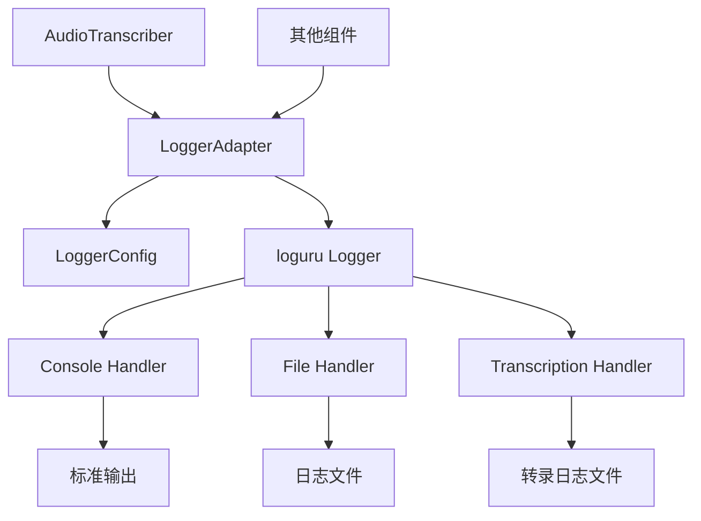

# 设计文档

## 概述

增强日志系统采用loguru框架，为DeepEcho实时语音AI助手提供现代化的日志管理功能。loguru提供了开箱即用的功能，包括自动文件轮转、彩色输出、异步处理等。该设计通过创建一个轻量级的适配层，将loguru集成到现有系统中。

核心设计原则：
- **最小侵入性**: 通过适配层与现有代码无缝集成
- **开箱即用**: 利用loguru的内置功能，减少自定义代码
- **高性能**: loguru的异步处理确保不影响实时处理
- **灵活配置**: 支持运行时配置和多级别日志控制

## 架构

### 系统架构



## 组件和接口

### 1. LoggerAdapter

日志适配器，为应用程序提供统一的日志接口。

```python
class LoggerAdapter:
    """基于loguru框架的日志适配器"""
    
    def __init__(self, name: str, config: LoggerConfig):
        """初始化日志适配器"""
        pass
    
    def log_transcription(
        self, 
        source: str, 
        text: str, 
        timestamp: datetime,
        metadata: Optional[Dict[str, Any]] = None
    ) -> None:
        """记录音频转录日志"""
        pass
    
    def debug(self, message: str, **kwargs) -> None:
        """记录DEBUG级别日志"""
        pass
    
    def info(self, message: str, **kwargs) -> None:
        """记录INFO级别日志"""
        pass
    
    def warning(self, message: str, **kwargs) -> None:
        """记录WARNING级别日志"""
        pass
    
    def error(self, message: str, **kwargs) -> None:
        """记录ERROR级别日志"""
        pass
    
    def set_level(self, level: str) -> None:
        """设置日志级别"""
        pass
    
    def enable_console_output(self, enabled: bool) -> None:
        """启用或禁用控制台输出"""
        pass
```

### 2. LoggerConfig

日志配置管理类。

```python
@dataclass
class LoggerConfig:
    """日志系统配置"""
    
    # 基本配置
    log_level: str = "INFO"
    
    # 控制台输出配置
    console_enabled: bool = True
    console_format: str = (
        "<level>{level: <8}</level> | "
        "<cyan>{name}</cyan>:<cyan>{function}</cyan> - "
        "<level>{message}</level>"
    )
    
    # 文件输出配置
    file_enabled: bool = True
    log_file_path: str = "./logs/deepecho.log"
    file_format: str = (
        "{time:YYYY-MM-DD HH:mm:ss} | "
        "{level: <8} | {name}:{function} - {message}"
    )
    
    # 文件轮转配置
    max_file_size: int = 10 * 1024 * 1024  # 10MB
    backup_count: int = 5
    
    # 转录日志配置
    transcription_log_enabled: bool = True
    transcription_log_file: str = "./logs/transcription.log"
    transcription_log_level: str = "DEBUG"
    
    def validate(self) -> Tuple[bool, List[str]]:
        """验证配置有效性"""
        pass
    
    @classmethod
    def from_file(cls, config_path: str) -> 'LoggerConfig':
        """从配置文件加载"""
        pass
```

### 3. TranscriptionLogHandler

专门处理转录日志的处理器。

```python
class TranscriptionLogHandler:
    """专门处理音频转录日志的处理器"""
    
    def __init__(self, config: LoggerConfig):
        """初始化转录日志处理器"""
        pass
    
    def log_transcription(
        self, 
        source: str, 
        text: str, 
        timestamp: datetime,
        metadata: Optional[Dict[str, Any]] = None
    ) -> None:
        """记录转录日志"""
        pass
    
    def format_transcription_message(
        self, 
        source: str, 
        text: str, 
        timestamp: datetime
    ) -> str:
        """格式化转录日志消息"""
        pass
```

### 4. LoggerFactory

日志工厂类，用于创建和管理日志实例。

```python
class LoggerFactory:
    """日志工厂类，基于loguru框架"""
    
    @classmethod
    def initialize(cls, config: LoggerConfig) -> None:
        """初始化日志工厂"""
        pass
    
    @classmethod
    def get_logger(cls, name: str) -> LoggerAdapter:
        """获取或创建日志记录器"""
        pass
    
    @classmethod
    def configure_loguru(cls, config: LoggerConfig) -> None:
        """配置loguru框架"""
        pass
    
    @classmethod
    def shutdown(cls) -> None:
        """关闭日志系统"""
        pass
```

## 数据模型

### TranscriptionLogEntry

```python
@dataclass
class TranscriptionLogEntry:
    """转录日志条目"""
    
    source: str  # "You" 或 "Speaker"
    text: str  # 转录文本
    timestamp: datetime  # 转录时间
    text_length: int  # 文本长度
    metadata: Dict[str, Any]  # 额外元数据
```

## 正确性属性

### 属性1：日志级别过滤一致性

*对于任何*日志记录器配置和日志消息，当日志级别设置为L时，只有级别大于或等于L的消息应该被输出。

**验证：需求 6.2, 6.3**

### 属性2：转录日志完整性

*对于任何*成功的音频转录，如果转录日志启用且日志级别为DEBUG或更低，则必须生成一条包含源标识、完整文本内容、时间戳和文本长度的日志条目。

**验证：需求 2.1, 2.2, 2.3**

### 属性3：控制台输出配置响应性

*对于任何*控制台输出配置更改，当启用控制台输出时，后续的日志消息应该出现在标准输出；当禁用时，不应该出现在标准输出。

**验证：需求 3.1, 3.2**

### 属性4：文件日志持久性

*对于任何*写入文件的日志条目，在应用程序正常关闭后，该日志条目应该存在于日志文件中。

**验证：需求 4.2, 4.4**

### 属性5：文件轮转触发条件

*对于任何*日志文件，当文件大小达到或超过配置的最大大小时，应该自动创建新的日志文件。

**验证：需求 5.1, 5.4**

### 属性6：历史文件数量限制

*对于任何*时刻的日志文件系统状态，存在的历史日志文件数量不应超过配置的backup_count值。

**验证：需求 5.2, 5.3**

### 属性7：转录日志隔离

*对于任何*转录日志条目，当启用转录日志专用处理时，该条目应该被写入专用的转录日志文件。

**验证：需求 7.1, 7.2, 7.4**

### 属性8：配置优先级

*对于任何*同时存在配置文件和命令行参数的情况，命令行参数应该覆盖配置文件中的相应设置。

**验证：需求 6.5**

## 错误处理

### 文件系统错误
- loguru自动处理文件创建和权限问题
- 如果写入失败，记录警告到控制台
- 尝试使用备用路径

### 配置错误
- 使用默认值替换无效参数
- 记录警告消息
- 继续初始化日志系统

### 格式化错误
- 使用简单的回退格式
- 记录格式化错误
- 继续输出日志

## 测试策略

### 单元测试

1. **日志级别过滤测试** - 验证不同日志级别的过滤行为
2. **配置验证测试** - 验证有效和无效的配置参数
3. **格式化测试** - 验证日志格式的正确性
4. **文件轮转测试** - 验证文件轮转的触发和清理
5. **转录日志测试** - 验证转录日志的记录和隔离

### 属性测试

使用Hypothesis库进行属性测试，最少100次迭代：

1. **属性1测试** - 日志级别过滤一致性
2. **属性2测试** - 转录日志完整性
3. **属性3测试** - 控制台输出配置响应性
4. **属性4测试** - 文件日志持久性
5. **属性5测试** - 文件轮转触发条件
6. **属性6测试** - 历史文件数量限制
7. **属性7测试** - 转录日志隔离
8. **属性8测试** - 配置优先级

### 集成测试

1. **与AudioTranscriber集成** - 测试转录日志的端到端流程
2. **与ConfigManager集成** - 测试配置加载和应用
3. **多线程环境测试** - 验证线程安全性

### 性能测试

1. **吞吐量测试** - 目标：>50,000条/秒
2. **延迟测试** - 目标：<1ms
3. **内存使用测试** - 验证无内存泄漏
4. **CPU开销测试** - 验证最低水平

## 实现注意事项

### loguru集成

1. **移除默认处理器**
   ```python
   from loguru import logger
   logger.remove()
   ```

2. **添加自定义处理器**
   - 控制台处理器（带彩色输出）
   - 文件处理器（纯文本格式）
   - 转录日志处理器（专用文件）

3. **配置文件轮转**
   ```python
   logger.add(
       "logs/app.log",
       rotation="10 MB",
       retention=5,
       format="{time:YYYY-MM-DD HH:mm:ss} | {level: <8} | {message}"
   )
   ```

### 与现有代码集成

1. 在`src/utils/logger.py`中创建适配层
2. 在`AudioTranscriber`中添加日志调用
3. 在`ConfigManager`中添加日志配置

### 配置文件格式

在`resources/config.json`中添加日志配置节：

```json
{
  "logging": {
    "level": "INFO",
    "console_enabled": true,
    "file_enabled": true,
    "log_file_path": "./logs/deepecho.log",
    "transcription_log_file": "./logs/transcription.log",
    "max_file_size_mb": 10,
    "backup_count": 5,
    "transcription_debug": false
  }
}
```

### 命令行参数

- `--log-level`: 设置日志级别
- `--log-console`: 启用/禁用控制台输出
- `--log-file`: 指定日志文件路径
- `--transcription-debug`: 启用转录DEBUG日志
