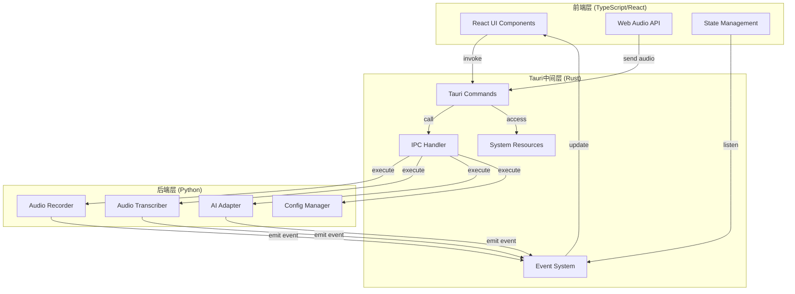

# 前后端分离架构重构 - 设计文档

## 概述

DeepEcho系统采用Tauri框架实现前后端分离架构。系统分为三层：
1. **前端层** (TypeScript/React): 用户界面和交互
2. **中间层** (Tauri/Rust): 进程间通信和系统资源访问
3. **后端层** (Python): AI处理和核心业务逻辑

这种架构提供了灵活性、可维护性和跨平台支持，同时保持了现有Python后端的功能。

## 架构设计

### 系统架构图



### 分层架构

#### 前端层 (TypeScript/React + Material-UI)

**职责**:
- 用户界面渲染
- 用户交互处理
- 实时数据显示
- 状态管理

**主要组件**:
```
frontend/
├── src/
│   ├── components/
│   │   ├── TranscriptDisplay.tsx      # 转录显示组件
│   │   ├── ResponseDisplay.tsx        # 响应显示组件
│   │   ├── ControlPanel.tsx           # 控制面板
│   │   ├── ProviderSelector.tsx       # AI厂商选择器
│   │   ├── StatusIndicator.tsx        # 状态指示器
│   │   ├── AudioDeviceSelector.tsx    # 音频设备选择器
│   │   └── AudioVisualizer.tsx        # 音频可视化组件
│   ├── hooks/
│   │   ├── useAudioRecording.ts       # 音频录制hook
│   │   ├── useTranscript.ts           # 转录数据hook
│   │   ├── useResponse.ts             # 响应数据hook
│   │   ├── useTauriCommand.ts         # Tauri命令hook
│   │   └── useAudioDevices.ts         # 音频设备hook
│   ├── services/
│   │   ├── tauriService.ts            # Tauri命令服务
│   │   ├── audioService.ts            # Web Audio API服务
│   │   └── eventService.ts            # 事件监听服务
│   ├── store/
│   │   ├── appStore.ts                # 应用状态存储
│   │   └── uiStore.ts                 # UI状态存储
│   ├── types/
│   │   ├── api.ts                     # API类型定义
│   │   ├── audio.ts                   # 音频类型定义
│   │   └── ui.ts                      # UI类型定义
│   ├── theme/
│   │   ├── theme.ts                   # Material-UI主题配置
│   │   └── colors.ts                  # 颜色定义
│   ├── App.tsx                        # 主应用组件
│   └── main.tsx                       # 应用入口
├── public/
├── package.json
├── tsconfig.json
├── vite.config.ts
└── index.html
```

**关键技术**:
- React 18+ 用于UI框架
- TypeScript 用于类型安全
- Material-UI (MUI) 用于UI组件库
- Zustand 用于状态管理
- Web Audio API 用于音频采集和可视化
- Tauri API 用于与后端通信

#### Tauri中间层 (Rust)

**职责**:
- 前后端通信管理
- 系统资源访问
- 事件分发
- 错误处理

**主要模块**:
```
src-tauri/
├── src/
│   ├── commands/
│   │   ├── audio.rs                   # 音频相关命令
│   │   ├── transcription.rs           # 转录相关命令
│   │   ├── ai.rs                      # AI相关命令
│   │   ├── config.rs                  # 配置相关命令
│   │   └── system.rs                  # 系统相关命令
│   ├── handlers/
│   │   ├── ipc_handler.rs             # IPC处理器
│   │   ├── event_handler.rs           # 事件处理器
│   │   └── error_handler.rs           # 错误处理器
│   ├── services/
│   │   ├── python_service.rs          # Python服务管理
│   │   ├── file_service.rs            # 文件服务
│   │   └── system_service.rs          # 系统服务
│   ├── models/
│   │   ├── request.rs                 # 请求模型
│   │   ├── response.rs                # 响应模型
│   │   └── event.rs                   # 事件模型
│   ├── lib.rs
│   └── main.rs
├── Cargo.toml
└── tauri.conf.json
```

**关键技术**:
- Tauri 用于跨平台框架
- Tokio 用于异步运行时
- Serde 用于序列化/反序列化
- Python subprocess 用于启动Python服务

#### 后端层 (Python)

**职责**:
- 音频采集和处理（麦克风和扬声器）
- 语音转录
- AI响应生成
- 配置管理
- 事件发送

**现有模块**:
```
src/
├── audio/
│   ├── recorder.py                    # 音频录制器（支持mic和speaker）
│   ├── transcriber.py                 # 音频转录器
│   └── models.py                      # 转录模型管理
├── audio_system/
│   ├── audio_interface.py             # 音频接口抽象
│   ├── audio_factory.py               # 音频设备工厂
│   ├── windows_audio.py               # Windows WASAPI loopback实现
│   └── macos_audio.py                 # macOS BlackHole实现
├── ai/
│   ├── adapter.py                     # AI适配器
│   ├── responder.py                   # AI响应器
│   └── providers/                     # AI提供商实现
├── config/
│   ├── config_manager.py              # 配置管理器
│   └── settings.py                    # 配置参数
├── utils/
│   ├── logger.py                      # 日志工具
│   ├── exceptions.py                  # 异常定义
│   └── event_emitter.py               # 事件发送器
└── backend_service.py                 # 后端服务主程序
```

**新增模块**:
```
src/
├── api/
│   ├── __init__.py
│   ├── server.py                      # HTTP/IPC服务器
│   ├── handlers.py                    # 请求处理器
│   └── models.py                      # 数据模型
└── ipc/
    ├── __init__.py
    ├── ipc_server.py                  # IPC服务器
    └── message_handler.py             # 消息处理器
```

**音频采集架构**:

后端保持现有的音频采集方式：
- **麦克风采集**: 使用 `sr.Microphone()` 直接访问系统默认麦克风
- **扬声器采集** (Windows): 使用 PyAudioWPatch 的 WASAPI loopback 设备
- **扬声器采集** (macOS): 使用 BlackHole 虚拟音频设备

前端通过Tauri命令调用后端的音频采集功能：
1. 前端请求获取可用音频设备列表
2. 后端返回系统中可用的麦克风和扬声器设备
3. 前端显示设备选择界面
4. 用户选择设备后，前端通过Tauri命令启动后端的音频录制
5. 后端持续采集音频并通过事件推送转录结果到前端

### 通信协议

#### Tauri命令定义

```rust
// 音频相关命令
#[tauri::command]
async fn start_recording(device_type: String) -> Result<String, String>
// device_type: "microphone" 或 "speaker"

#[tauri::command]
async fn stop_recording() -> Result<String, String>

#[tauri::command]
async fn get_transcript() -> Result<TranscriptData, String>

#[tauri::command]
async fn get_audio_devices() -> Result<Vec<AudioDevice>, String>
// 返回系统中可用的麦克风和扬声器设备列表

#[tauri::command]
async fn set_audio_device(device_type: String, device_id: String) -> Result<String, String>
// 设置要使用的音频设备

// AI相关命令
#[tauri::command]
async fn generate_response(context: String) -> Result<String, String>

#[tauri::command]
async fn switch_provider(provider: String) -> Result<String, String>

// 配置相关命令
#[tauri::command]
async fn get_config() -> Result<ConfigData, String>

#[tauri::command]
async fn update_config(config: ConfigData) -> Result<String, String>

// 系统相关命令
#[tauri::command]
async fn get_system_info() -> Result<SystemInfo, String>
```

#### 事件定义

```typescript
// 前端监听的事件
interface TauriEvents {
  'transcript-updated': TranscriptData
  'response-generated': ResponseData
  'status-changed': SystemStatus
  'error-occurred': ErrorInfo
  'config-updated': ConfigData
}

// 后端发送的事件
interface BackendEvents {
  'audio-started': void
  'audio-stopped': void
  'transcription-complete': TranscriptResult
  'response-ready': ResponseResult
  'error': ErrorMessage
}
```

#### 数据模型

```typescript
// 转录数据
interface TranscriptData {
  id: string
  timestamp: number
  source: 'microphone' | 'speaker'
  text: string
  confidence: number
}

// 响应数据
interface ResponseData {
  id: string
  timestamp: number
  provider: string
  text: string
  context: string
}

// 系统状态
interface SystemStatus {
  state: 'idle' | 'recording' | 'processing' | 'error'
  message: string
  details?: Record<string, any>
}

// 配置数据
interface ConfigData {
  audio: {
    recordTimeout: number
    energyThreshold: number
    device?: string
  }
  ai: {
    provider: string
    model: string
    apiKey: string
  }
  ui: {
    updateInterval: number
    theme: 'light' | 'dark'
  }
}
```

## 项目结构

```
deepecho-refactored/
├── frontend/                          # React前端应用
│   ├── src/
│   │   ├── components/
│   │   ├── hooks/
│   │   ├── services/
│   │   ├── store/
│   │   ├── types/
│   │   ├── App.tsx
│   │   └── main.tsx
│   ├── public/
│   ├── package.json
│   ├── tsconfig.json
│   ├── vite.config.ts
│   └── index.html
│
├── src-tauri/                         # Tauri中间层
│   ├── src/
│   │   ├── commands/
│   │   ├── handlers/
│   │   ├── services/
│   │   ├── models/
│   │   ├── lib.rs
│   │   └── main.rs
│   ├── Cargo.toml
│   └── tauri.conf.json
│
├── backend/                           # Python后端服务
│   ├── src/
│   │   ├── audio/
│   │   ├── ai/
│   │   ├── config/
│   │   ├── api/
│   │   ├── ipc/
│   │   ├── utils/
│   │   └── backend_service.py
│   ├── tests/
│   ├── requirements.txt
│   └── setup.py
│
├── docs/                              # 文档
│   ├── architecture.md
│   ├── api.md
│   ├── development.md
│   └── deployment.md
│
├── scripts/                           # 构建和部署脚本
│   ├── build.sh
│   ├── dev.sh
│   └── package.sh
│
├── .github/
│   └── workflows/                     # CI/CD工作流
│
├── README.md
├── LICENSE
└── .gitignore
```

## 正确性属性

*属性是应该在系统所有有效执行中保持为真的特征或行为——本质上是关于系统应该做什么的正式声明。属性作为人类可读规范和机器可验证正确性保证之间的桥梁。*

### 属性1：前后端通信一致性
*对于任何*Tauri命令调用，前端发送的请求应该被后端正确接收和处理，响应应该被前端正确接收
**验证需求: 2.1, 2.2, 3.1-3.5**

### 属性2：事件推送可靠性
*对于任何*后端生成的事件，前端应该能够接收到该事件，并且事件数据应该完整准确
**验证需求: 7.1-7.6**

### 属性3：UI实时更新
*对于任何*接收到的事件，前端UI应该立即更新相应的显示区域
**验证需求: 1.2-1.3**

### 属性4：配置持久化
*对于任何*配置修改，修改后的配置应该被保存到文件系统，应用重启后应该加载相同的配置
**验证需求: 9.1-9.6**

### 属性5：错误处理完整性
*对于任何*错误情况，系统应该捕获错误、记录日志、通知用户，并继续运行
**验证需求: 8.1-8.6**

### 属性6：音频数据完整性
*对于任何*采集的音频数据，从Web Audio API采集到后端处理的整个过程中，数据应该保持完整
**验证需求: 5.1-5.6**

### 属性7：系统资源访问安全性
*对于任何*系统资源访问请求，Tauri应该验证权限并安全地执行操作
**验证需求: 6.1-6.6**

### 属性8：跨平台一致性
*对于任何*功能，在Windows和macOS上的行为应该一致
**验证需求: 10.1-10.6**

### 属性9：性能响应性
*对于任何*用户操作，系统应该在100ms内做出响应
**验证需求: 11.1-11.6**

### 属性10：状态同步一致性
*对于任何*系统状态变化，前端状态存储应该与后端状态保持同步
**验证需求: 1.1, 2.1-2.7**

## 测试策略

### 单元测试

**前端测试**:
- React组件渲染测试
- Hook逻辑测试
- 状态管理测试
- 服务函数测试

**Tauri测试**:
- 命令处理测试
- IPC通信测试
- 错误处理测试
- 系统资源访问测试

**后端测试**:
- 现有单元测试保持不变
- 新增IPC服务器测试
- 事件发送测试

### 集成测试

- 前后端通信流程测试
- 完整的音频处理流程测试
- AI响应生成流程测试
- 配置管理流程测试

### 属性测试

- 通信一致性属性测试
- 事件推送可靠性属性测试
- 配置持久化属性测试
- 错误处理属性测试

### 性能测试

- UI响应时间测试
- 内存使用测试
- CPU使用测试
- 长时间运行稳定性测试

## 开发流程

### 开发环境设置

1. **前端开发**:
   ```bash
   cd frontend
   npm install
   npm run dev
   ```

2. **Tauri开发**:
   ```bash
   cd backend-tauri
   cargo build
   ```

3. **后端开发**:
   ```bash
   cd backend
   pip install -r requirements.txt
   python backend/backend_service.py
   ```

### 构建流程

1. **开发构建**:
   ```bash
   npm run tauri dev
   ```

2. **生产构建**:
   ```bash
   npm run tauri build
   ```

### 部署流程

1. **本地部署**: 直接运行构建的可执行文件
2. **云端部署**: 后端部署到服务器，前端通过HTTP访问

## 迁移策略

### 第一阶段：架构准备
- 创建Tauri项目结构
- 创建React前端框架
- 设计通信协议

### 第二阶段：前端开发
- 实现React UI组件
- 实现Web Audio API集成
- 实现Tauri命令调用

### 第三阶段：中间层开发
- 实现Tauri命令处理
- 实现IPC通信
- 实现事件系统

### 第四阶段：后端适配
- 创建IPC服务器
- 实现事件发送
- 适配现有功能

### 第五阶段：集成测试
- 端到端测试
- 性能测试
- 跨平台测试

### 第六阶段：发布
- 打包应用
- 发布到应用商店
- 提供更新机制
