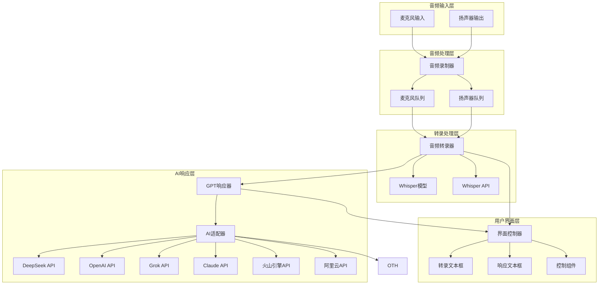

# 设计文档

## 概述

DeepEcho实时语音AI助手系统采用多线程架构，实现音频捕获、语音转录和AI响应生成的并行处理。系统设计重点关注低延迟、高可靠性和跨平台兼容性，支持本地和云端两种转录模式。

## 项目结构规范

### 目录组织

项目采用标准的src/test分离结构，按照架构分层组织代码：

```
deepecho/
├── src/                          # 源代码目录
│   ├── __init__.py
│   ├── main.py                   # 应用程序入口
│   ├── config/                   # 配置管理层
│   │   ├── __init__.py
│   │   ├── config_manager.py    # 配置管理器
│   │   └── settings.py          # 配置参数定义
│   ├── audio/                    # 音频处理层
│   │   ├── __init__.py
│   │   ├── recorder.py          # 音频录制器
│   │   ├── transcriber.py       # 音频转录器
│   │   └── models.py            # 转录模型管理
│   ├── audio_system/             # 平台特定音频系统
│   │   ├── __init__.py
│   │   ├── audio_interface.py   # 音频接口抽象
│   │   ├── audio_factory.py     # 音频设备工厂
│   │   ├── macos_audio.py       # macOS音频实现
│   │   └── windows_audio.py     # Windows音频实现
│   ├── ai/                       # AI响应层
│   │   ├── __init__.py
│   │   ├── adapter.py           # AI适配器
│   │   ├── providers/           # AI提供商实现
│   │   │   ├── __init__.py
│   │   │   ├── base_provider.py # 提供商基类
│   │   │   ├── deepseek_provider.py
│   │   │   ├── openai_provider.py
│   │   │   ├── grok_provider.py
│   │   │   ├── claude_provider.py
│   │   │   ├── volcano_provider.py
│   │   │   └── aliyun_provider.py
│   │   └── responder.py         # GPT响应器
│   ├── ui/                       # 用户界面层
│   │   ├── __init__.py
│   │   ├── controller.py        # UI控制器
│   │   └── components.py        # UI组件
│   └── utils/                    # 工具模块
│       ├── __init__.py
│       ├── logger.py            # 日志工具
│       └── exceptions.py        # 自定义异常
├── tests/                        # 测试目录
│   ├── __init__.py
│   ├── conftest.py              # pytest配置和fixtures
│   ├── unit/                    # 单元测试
│   │   ├── __init__.py
│   │   ├── test_audio_recorder.py
│   │   ├── test_audio_transcriber.py
│   │   ├── test_ai_adapter.py
│   │   └── test_ui_controller.py
│   ├── property/                # 属性测试
│   │   ├── __init__.py
│   │   ├── test_audio_properties.py
│   │   ├── test_ai_properties.py
│   │   └── test_ui_properties.py
│   └── integration/             # 集成测试
│       ├── __init__.py
│       └── test_end_to_end.py
├── custom_speech_recognition/    # 第三方库（保持原样）
├── requirements.txt              # 生产依赖
├── requirements-dev.txt          # 开发依赖
├── README.md
└── .gitignore
```

### 文件命名规范

#### Python源文件
- **模块文件**: 使用小写字母和下划线，如 `audio_recorder.py`, `config_manager.py`
- **类文件**: 一个文件包含一个主要类，文件名与类名对应但使用snake_case，如 `AudioRecorder` 类 → `audio_recorder.py`
- **工具模块**: 使用描述性名称，如 `logger.py`, `exceptions.py`

#### 测试文件
- **单元测试**: `test_<module_name>.py`，如 `test_audio_recorder.py`
- **属性测试**: `test_<feature>_properties.py`，如 `test_audio_properties.py`
- **集成测试**: `test_<integration_scenario>.py`，如 `test_end_to_end.py`

#### 配置文件
- **Python配置**: `settings.py`, `config.py`
- **JSON配置**: `config.json`, `settings.json`
- **环境配置**: `.env`, `.env.example`

### 命名约定

#### 类命名 (PascalCase)
```python
class AudioRecorder:          # 音频录制器
class AIAdapter:              # AI适配器
class DeepSeekProvider:       # DeepSeek提供商
class ConfigManager:          # 配置管理器
```

#### 函数和方法命名 (snake_case)
```python
def record_into_queue():      # 录制到队列
def adjust_for_noise():       # 调整噪音
def get_default_speaker():    # 获取默认扬声器
def generate_response():      # 生成响应
```

#### 常量命名 (UPPER_SNAKE_CASE)
```python
RECORD_TIMEOUT = 3
ENERGY_THRESHOLD = 1000
DEFAULT_AI_PROVIDER = "deepseek"
MAX_RETRIES = 3
```

#### 私有成员命名 (前缀下划线)
```python
def _get_default_speaker():   # 私有方法
self._stop_listening = None   # 私有属性
```

### 导入规范

```python
# 标准库导入
import os
import logging
from datetime import datetime
from typing import Optional, Callable

# 第三方库导入
import numpy as np
import custom_speech_recognition as sr

# 本地模块导入
from src.audio.recorder import AudioRecorder
from src.ai.adapter import AIAdapter
from src.config.settings import RECORD_TIMEOUT
```

## 编码规范

### 代码注释规范
- 所有代码注释必须使用英文
- 函数和类的文档字符串使用英文
- 变量名和函数名使用英文
- 日志消息使用英文

### 代码风格
- 遵循PEP 8 Python编码规范
- 使用类型提示（Type Hints）
- 函数和类必须包含文档字符串
- 使用有意义的变量和函数名

### 示例代码格式
```python
class AudioTranscriber:
    """
    Audio transcriber that converts speech to text in real-time.
    
    This class handles audio processing from microphone and speaker sources,
    manages transcription history, and provides thread-safe access to results.
    """
    
    def __init__(self, mic_source, speaker_source, model):
        """
        Initialize the audio transcriber.
        
        Args:
            mic_source: Microphone audio source
            speaker_source: Speaker audio source  
            model: Speech recognition model
        """
        # Initialize transcript data storage
        self.transcript_data = {"You": [], "Speaker": []}
        # Event to signal transcript changes
        self.transcript_changed_event = threading.Event()
```

## 架构

### 系统架构图



### 线程架构

系统采用多线程设计确保实时性能：

1. **主线程**: UI事件循环和用户交互
2. **音频录制线程**: 持续捕获音频数据（后台守护线程）
3. **转录处理线程**: 处理音频队列并生成转录（后台守护线程）
4. **AI响应线程**: 生成智能响应建议（后台守护线程）

## 组件和接口

### 音频录制器 (AudioRecorder)

**职责**: 捕获系统音频输入和输出

**接口**:
```python
class BaseRecorder:
    def __init__(self, source: sr.Microphone)
    def adjust_for_noise(self, device_name: str, msg: str) -> None
    def record_into_queue(self, audio_queue: queue.Queue) -> None

class DefaultMicRecorder(BaseRecorder):
    def __init__(self)

class DefaultSpeakerRecorder(BaseRecorder):
    def __init__(self)
    def _get_default_speaker(self) -> dict
```

**平台特定实现**:
- Windows: Uses PyAudioWPatch and WASAPI loopback devices
- macOS: Uses BlackHole virtual audio device

### 音频转录器 (AudioTranscriber)

**职责**: Converts audio streams to text and manages transcription history

**接口**:
```python
class AudioTranscriber:
    def __init__(self, mic_source, speaker_source, model)
    def transcribe_audio_queue(self, speaker_queue: queue.Queue, mic_queue: queue.Queue) -> None
    def update_transcript(self, who_spoke: str, text: str, time_spoken: datetime) -> None
    def get_transcript(self) -> str
    def get_speaker_newest(self, last_time: datetime) -> tuple[datetime, str]
    def clear_transcript_data(self) -> None
```

**数据结构**:
```python
transcript_data = {
    "You": [(text, timestamp), ...],      # Microphone input transcription
    "Speaker": [(text, timestamp), ...]   # Speaker output transcription
}
```

### AI适配器 (AIAdapter)

**职责**: Provides unified AI service interface supporting multiple AI providers

**接口**:
```python
from abc import ABC, abstractmethod

class AIProvider(ABC):
    @abstractmethod
    def generate_response(self, prompt: str) -> str:
        pass
    
    @abstractmethod
    def get_provider_name(self) -> str:
        pass

class DeepSeekProvider(AIProvider):
    def __init__(self, api_key: str, model: str = "deepseek-chat")
    def generate_response(self, prompt: str) -> str
    def get_provider_name(self) -> str

class OpenAIProvider(AIProvider):
    def __init__(self, api_key: str, model: str = "gpt-3.5-turbo")
    def generate_response(self, prompt: str) -> str
    def get_provider_name(self) -> str

class GrokProvider(AIProvider):
    def __init__(self, api_key: str, model: str = "grok-beta")
    def generate_response(self, prompt: str) -> str
    def get_provider_name(self) -> str

class ClaudeProvider(AIProvider):
    def __init__(self, api_key: str, model: str = "claude-3-sonnet")
    def generate_response(self, prompt: str) -> str
    def get_provider_name(self) -> str

class VolcanoEngineProvider(AIProvider):
    def __init__(self, api_key: str, model: str = "doubao-pro")
    def generate_response(self, prompt: str) -> str
    def get_provider_name(self) -> str

class AliyunProvider(AIProvider):
    def __init__(self, api_key: str, model: str = "qwen-turbo")
    def generate_response(self, prompt: str) -> str
    def get_provider_name(self) -> str

class AIAdapter:
    def __init__(self, provider: AIProvider)
    def set_provider(self, provider: AIProvider) -> None
    def generate_response(self, prompt: str) -> str
    def get_current_provider(self) -> str
```

### GPT响应器 (GPTResponder)

**职责**: Generates AI response suggestions based on conversation context, supports multiple AI provider switching

**接口**:
```python
class GPTResponder:
    def __init__(self, ai_adapter: AIAdapter)
    def respond_to_transcriber(self, transcriber: AudioTranscriber) -> None
    def update_response_interval(self, interval: int) -> None
    def switch_ai_provider(self, provider: AIProvider) -> None

def generate_response_from_transcript(transcript: str, ai_adapter: AIAdapter) -> str
```

### 界面控制器 (UIController)

**职责**: Manages user interface and user interactions

**接口**:
```python
def init_ui() -> ctk.CTk
def create_ui_components(root, transcriber, speaker_queue, mic_queue) -> tuple
def update_transcript_UI(transcriber, textbox) -> None
def update_response_UI(responder, textbox, slider_label, slider, freeze_state) -> None
def clear_context(transcriber, speaker_queue, mic_queue) -> None
```

## 数据模型

### 音频数据流

```python
# Audio queue item format
AudioQueueItem = tuple[bytes, datetime]  # (audio_data, timestamp)

# Transcript history item format  
TranscriptItem = tuple[str, datetime]    # (formatted_text, timestamp)
```

### 转录模型配置

```python
class TranscriberModel:
    def get_transcription(self, audio_file_path: str) -> str
    
# Supported model types
ModelType = Union[LocalWhisperModel, APIWhisperModel]
```

### AI厂商配置

```python
# AI provider configuration
class AIProviderConfig:
    provider_type: str          # "deepseek", "openai", "grok", "claude", "volcano", "aliyun"
    api_key: str               # API key
    model: str                 # Model name
    base_url: str              # API base URL (optional)
    timeout: int = 30          # Request timeout
    max_retries: int = 3       # Maximum retry attempts

# Supported AI providers
SUPPORTED_PROVIDERS = {
    "deepseek": {
        "models": ["deepseek-chat", "deepseek-coder"],
        "default_model": "deepseek-chat"
    },
    "openai": {
        "models": ["gpt-3.5-turbo", "gpt-4", "gpt-4-turbo", "gpt-4o"],
        "default_model": "gpt-3.5-turbo"
    },
    "grok": {
        "models": ["grok-beta", "grok-2"],
        "default_model": "grok-beta"
    },
    "claude": {
        "models": ["claude-3-haiku", "claude-3-sonnet", "claude-3-opus"],
        "default_model": "claude-3-sonnet"
    },
    "volcano": {
        "models": ["doubao-pro", "doubao-lite"],
        "default_model": "doubao-pro"
    },
    "aliyun": {
        "models": ["qwen-turbo", "qwen-plus", "qwen-max"],
        "default_model": "qwen-turbo"
    }
}
```

### 系统配置参数

```python
# Audio processing parameters
RECORD_TIMEOUT = 3          # Recording timeout (seconds)
PHRASE_TIMEOUT = 3.05       # Phrase timeout (seconds)
MAX_PHRASES = 10            # Maximum phrase count
ENERGY_THRESHOLD = 1000     # Energy threshold

# Performance parameters
PROCESSING_INTERVAL = 0.1   # Processing interval (seconds)
UI_UPDATE_INTERVAL = 0.3    # UI update interval (seconds)

# AI response parameters
DEFAULT_AI_PROVIDER = "deepseek"         # Default AI provider
RESPONSE_TIMEOUT = 30              # AI response timeout (seconds)
MAX_AI_RETRIES = 3                 # Maximum AI request retries
```

## 错误处理

### 错误类型和处理策略

1. **音频设备错误**
   - Device not found: Display error message and gracefully exit
   - Device disconnection: Attempt to reconnect and notify user

2. **转录错误**
   - Model loading failure: Fallback to backup model or display error
   - API call failure: Exponential backoff retry with error logging

3. **网络错误**
   - API timeout: Retry mechanism with maximum retry limit
   - Connection failure: Display network status, suggest connection check

4. **资源错误**
   - Memory shortage: Clean old data, optimize queue size
   - CPU overload: Reduce processing frequency, optimize algorithms

### 错误恢复机制

```python
# Retry decorator
def retry_with_backoff(max_retries=3, backoff_factor=2):
    def decorator(func):
        def wrapper(*args, **kwargs):
            for attempt in range(max_retries):
                try:
                    return func(*args, **kwargs)
                except Exception as e:
                    if attempt == max_retries - 1:
                        raise e
                    time.sleep(backoff_factor ** attempt)
        return wrapper
    return decorator
```

## 正确性属性

*属性是应该在系统所有有效执行中保持为真的特征或行为——本质上是关于系统应该做什么的正式声明。属性作为人类可读规范和机器可验证正确性保证之间的桥梁。*

### 属性1：音频数据端到端处理
*对于任何*音频输入源（麦克风或扬声器），当检测到音频数据时，系统应将数据传输到处理队列并在2秒内完成转录显示更新
**验证需求: 1.3, 2.1, 2.4**

### 属性2：音频源区分标记
*对于任何*转录的音频数据，系统应正确标记其来源（"You"表示麦克风，"Speaker"表示扬声器输出）
**验证需求: 2.5**

### 属性3：AI响应生成完整性
*对于任何*新的转录文本，当有足够上下文时，AI适配器应通过当前配置的AI厂商分析完整对话历史并生成相关响应建议
**验证需求: 3.1, 3.2, 3.3**

### 属性4：AI厂商切换一致性
*对于任何*AI厂商切换操作，系统应无缝切换到新的AI提供商并保持响应生成功能正常
**验证需求: 扩展功能**

### 属性5：可配置更新间隔
*对于任何*配置的更新间隔设置，GPT响应器应按照指定间隔更新响应建议
**验证需求: 3.4**

### 属性6：UI实时响应更新
*对于任何*系统状态变化（转录更新或响应更新），界面控制器应立即刷新相应的显示区域
**验证需求: 4.2, 4.3**

### 属性6：冻结功能状态管理
*对于任何*冻结状态切换，界面应停止显示更新同时保持后台处理继续运行
**验证需求: 4.6**

### 属性7：配置显示同步
*对于任何*更新间隔设置变化，界面应立即显示当前正确的配置值
**验证需求: 4.7**

### 属性8：语言检测和处理模式
*对于任何*API模式下的音频输入，转录引擎应支持自动语言检测；对于本地模式，应使用英语处理
**验证需求: 6.1, 6.2**

### 属性9：模式切换一致性
*对于任何*转录模式切换（API/本地），系统应保持适合该模式的一致转录质量
**验证需求: 6.3**

### 属性10：处理模式选择
*对于任何*用户的处理模式选择，系统应正确应用相应的配置（本地快速英语或API多语言）
**验证需求: 6.4**

### 属性11：多线程架构稳定性
*对于任何*系统负载情况，音频处理应在独立守护线程中运行，防止UI冻结
**验证需求: 7.5, 8.2**

### 属性12：内存和队列管理
*对于任何*长时间运行场景，系统应管理音频队列大小和内存使用，防止资源溢出
**验证需求: 8.3, 8.4**

### 属性14：空闲状态资源优化
*对于任何*应用程序空闲期间，系统应最小化CPU使用同时保持音频监控功能
**验证需求: 8.5**

## 测试策略

### 双重测试方法

系统采用单元测试和基于属性的测试相结合的方法：

- **单元测试**: 验证具体示例、边缘情况和错误条件
- **属性测试**: 验证所有输入范围内的通用属性
- **两者互补**: 单元测试捕获具体错误，属性测试验证通用正确性

### 单元测试

**测试范围**:
- Audio device initialization and connection (Requirements 1.1, 1.2)
- System startup validation and configuration (Requirements 5.1-5.6)
- UI component initialization (Requirements 4.1, 4.4, 4.5)
- Error handling and edge cases (Requirements 1.4, 2.6, 3.5, 5.2, 7.1-7.4)
- Specific configuration testing (Requirements 2.2, 2.3, 5.3, 5.4, 6.2)

**测试工具**: pytest, unittest.mock

### 基于属性的测试

**配置要求**:
- Each property test runs minimum 100 iterations
- Use Python's Hypothesis library for property testing
- Each test tag format: **Feature: real-time-voice-ai-assistant, Property {number}: {property_text}**

**属性测试覆盖**:
- Audio data processing flow (Properties 1, 2)
- AI response generation logic (Properties 3, 4, 5)
- UI updates and state management (Properties 6, 7, 8)
- Multi-mode processing (Properties 9, 10, 11)
- System architecture and resource management (Properties 12, 13, 14)

### 集成测试

**测试场景**:
- Complete audio recording to transcription flow
- Multi-thread coordination and data synchronization
- API integration and error handling
- Cross-platform compatibility

### 性能测试

**测试指标**:
- Audio processing latency < 2 seconds
- Memory usage stability
- CPU usage optimization
- Long-term operation stability

**测试方法**:
- Simulate long-duration audio input
- Stress test multi-concurrent processing
- Memory leak detection